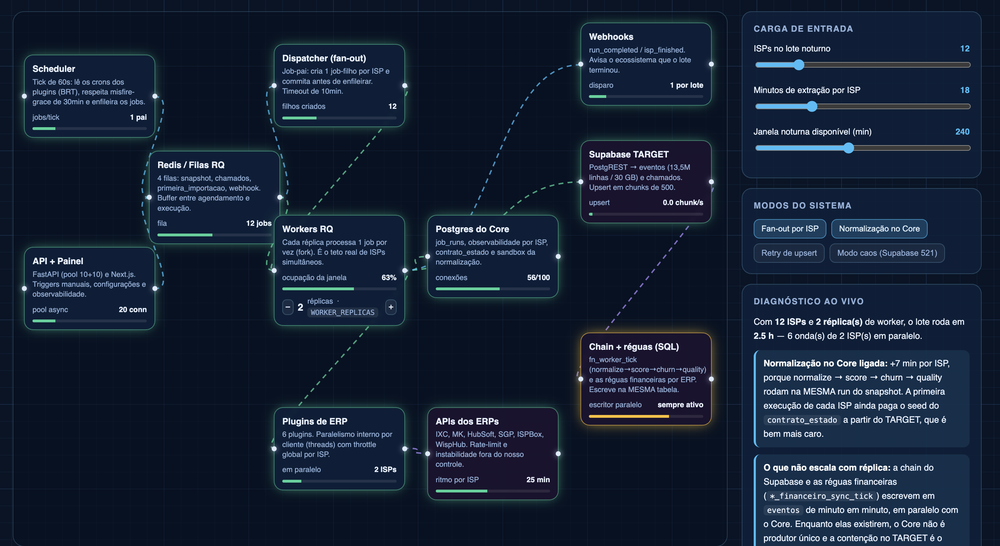

# System Design Playground 🎨

> **O simulador de infraestrutura e fluxo de carga interativo baseado em Blueprint para agentes de IA e IDEs de programação (Antigravity, Cursor, Claude, Codex, etc.).**

---

Sabe quando você tenta explicar a arquitetura de um sistema para alguém (especialmente iniciantes ou pessoas não-técnicas) e a pessoa começa a te olhar com aquela cara de *"tá falando grego"*? Ou quando você quer testar cenários de estresse no seu sistema mas não quer derrubar o ambiente? 

Esta skill resolve isso de um jeito **muito visual, interativo e direto ao ponto**!

## 🚀 O que ela faz?

Ela lê a estrutura do seu projeto atual ou a sua descrição de arquitetura e cria um **playground interativo local estilo blueprint** (uma grade azul clássica cheia de luzes e cabos que se mexem) rodando localmente no seu navegador.

Ao rodar a skill, ela analisa o projeto, gera o arquivo `system-design-canvas.html` na raiz do seu projeto e o **abre automaticamente no seu navegador padrão**.

---

## 🎮 Como funciona a interface interativa?

No arquivo HTML gerado, você ganha um painel operacional completo:
1. **Controle o tráfego**: Um controle deslizante (slider) no topo permite aumentar ou diminuir a quantidade de acessos por segundo (ex: de 100 a 5.000 req/s).
2. **Escale os recursos**: Botões de `+` e `-` nos cards dos componentes (App Server, Banco de Dados, Cache, Fila, Workers) permitem alterar as réplicas ativas em tempo real.
3. **Veja o gargalo acontecer**: À medida que o tráfego sobe ou você remove réplicas, as conexões mudam de cor (verde 🟢, laranja 🟡, vermelho 🔴) e aceleram a animação, mostrando exatamente onde a sobrecarga vai estourar primeiro.
4. **Painel de Dicas**: Um painel inteligente diz o que está quebrando e indica os arquivos e pastas do seu projeto que você precisa modificar para resolver.
5. **Selo de aferição**: O canvas mostra se as bases vieram de medição Locust ou do modelo calibrado (estimado).

---

## 🧪 Aferição de carga (Locust isolado)

Para reduzir chute do modelo, a skill pode ancorar métricas com Locust — **sem tocar produção**.

### Modos (nessa ordem)
1. **`docker_smoke`** — sobe um compose de smoke isolado, roda Locust na rede interna, coleta métricas e derruba o stack.
2. **`local_script`** — sem Docker (ou se você recusar o container), roda `loadtest/run-loadtest.sh` só contra localhost/smoke.
3. **`estimated_calibrated`** — se você pular a execução ou o alvo não estiver disponível, usa um modelo determinístico de capacidade (réplicas × RPS base + curva de latência).

### Consentimento
O agente **sempre pergunta antes** de subir container ou rodar o script. Sem o seu “sim”, cai no modo estimado.

### Artefatos gerados (no seu projeto)
- `loadtest/locustfile.py`
- `loadtest/run-loadtest.sh`
- `loadtest/docker-compose.loadtest.yml`
- `loadtest/load-metrics.json` (`source: measured | estimated` + `afericao_mode`)

### Observação final
Toda execução da skill termina dizendo **qual modo foi usado** (`docker_smoke`, `local_script` ou `estimated_calibrated`) e se as métricas são `measured` ou `estimated`.

---

## ⚡ Como Acionar a Skill no Chat

Você pode chamar e ativar a skill a qualquer momento usando o comando de atalho:
> `/system-design-playground` ou mencionando **"System Design Playground"**

---

## 🛠️ Como Instalar & Configurar nas IDEs e Agentes

Esta skill pode ser portada para qualquer ferramenta de desenvolvimento. Escolha sua IDE ou agente abaixo:

### 1. No Antigravity (Agente oficial do Google DeepMind)
Como esta skill é nativa da arquitetura do Antigravity, basta salvar o arquivo `SKILL.md` na pasta de skills do seu ambiente.

* **Instalação Global** (Para todos os projetos):
  Salve em: `~/.gemini/config/skills/system-design-playground/SKILL.md`
* **Instalação Local** (Apenas no repositório atual):
  Salve na raiz do projeto em: `.gemini/config/skills/system-design-playground/SKILL.md`

---

### 2. No Cursor (Cursor Rules)
Para fazer o Cursor agir como o simulador:
1. Abra o arquivo `.cursorrules` na raiz do seu projeto (se não existir, crie-o).
2. Copie o conteúdo do arquivo [SKILL.md](SKILL.md) e adicione-o ao arquivo `.cursorrules`.
3. Pronto! Quando você digitar `/system-design-playground` ou pedir para analisar o tráfego no chat do Cursor, ele gerará o HTML interativo na raiz do seu projeto.

---

### 3. No Claude (Claude Projects / Custom Instructions)
Se você estiver usando o Claude.ai:
* **Claude Projects (Recomendado)**: Crie um projeto, clique em **Project Instructions** e cole o conteúdo de [SKILL.md](SKILL.md) lá dentro.
* **Custom Instructions Globais**: Se não usar projetos, cole o texto de regras da skill nas suas instruções personalizadas de perfil.

---

### 4. No Codex / GitHub Copilot / Outros Editores
Para ferramentas genéricas que aceitam regras de contexto na workspace:
* Salve as regras de instrução de sistema no arquivo de regras do seu projeto (ex: `.github/copilot-instructions.md` para o Copilot ou nas configurações de prompts customizados do seu editor).

---

## 📄 Licença

Sinta-se livre para usar, melhorar e compartilhar! Distribuído sob a licença MIT.
